# Voitta RAG Enterprise — Operations & Data Flow

> A detailed, diagram-first walkthrough of how the system actually works at
> runtime: file ingestion, the job queue, the websocket event stream, search,
> the data model, the locking model, and — in depth — how **admin settings
> propagate** and how **admin-defined OAuth / sync providers surface to users**.
>
> Diagrams are [Mermaid](https://mermaid.js.org/). GitHub, VS Code (with the
> Mermaid extension), and most markdown viewers render them inline.

## Contents

1. [System overview](#1-system-overview)
2. [File ingestion pipeline](#2-file-ingestion-pipeline)
3. [Job queue mechanics](#3-job-queue-mechanics)
4. [File & job state machines](#4-file--job-state-machines)
5. [Event system & websocket propagation](#5-event-system--websocket-propagation)
6. [Search query path](#6-search-query-path)
7. [Identity & accounts: sign-in gate, Clerk directory, switching](#7-identity--accounts-sign-in-gate-clerk-directory-switching)
8. [Admin settings: storage & propagation](#8-admin-settings-storage--propagation)
9. [OAuth providers: admin defines → user consumes](#9-oauth-providers-admin-defines--user-consumes)
10. [Sync OAuth runtime flows](#10-sync-oauth-runtime-flows)
11. [Data model](#11-data-model)
12. [Locking model](#12-locking-model)
13. [Logging & observability](#13-logging--observability)

---

## 1. System overview

The system is a single FastAPI process (`main.py`) with a background worker
pool. Inputs (filesystem watcher, startup scanner, sync connectors) enqueue
jobs; a worker drains them through the extract → chunk → embed pipeline;
results land in three stores (CAS blobs on disk, SQLite metadata, Qdrant
vectors). A websocket pushes live state to the vanilla-ESM SPA. An MCP server
exposes the same data to LLM agents.

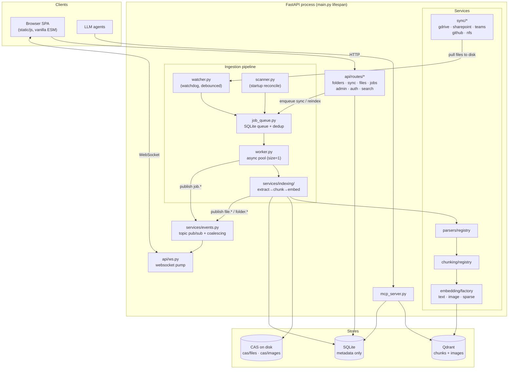

**Key invariants** (from the code's own module docstrings):

- Re-indexing is **whole-file** — any change resets `state='pending'` and
  re-runs the full extract → chunk → embed pipeline against the new bytes.
- **SQLite stores metadata only.** Extracted text and image bytes live in
  content-addressed `cas/` blobs (refcounted, GC-swept by `cas/gc.py`).
- **Two Qdrant collections**: `chunks` (dense e5-base-v2 + sparse BM25,
  RRF-fused) and `images` (SigLIP-2, searchable by text *or* image). Each
  point carries an `allowed_users` payload for the ACL filter.

### Qdrant runtime modes

`VOITTA_QDRANT_MODE` selects the vector-store backend
([config.py](../src/voitta_rag_enterprise/config.py)):

| Mode | What runs | Use |
|------|-----------|-----|
| `embedded` (default) | in-process `QdrantClient(path=…)` — pure Python, stripped-down engine | dev / small installs |
| `standalone` | external Qdrant server at `VOITTA_QDRANT_URL` | Docker / k8s |
| `managed` | the app spawns the **native Qdrant binary** as a localhost child process | desktop app, single-host server |

**Managed mode is hard-fail by design** — if the binary is missing, won't
launch, or doesn't become healthy, boot crashes; there is no fallback to
embedded. The lifecycle
([services/qdrant_process.py](../src/voitta_rag_enterprise/services/qdrant_process.py))
guarantees cradle-to-grave ownership of the sidecar:

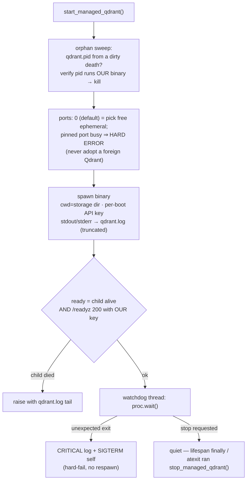

- **Storage** `data_dir/qdrant_managed/` (also holds `qdrant.pid`,
  `qdrant.log`, and `snapshots/` — snapshots path is pinned via env and the
  child's CWD is the storage dir, because Qdrant resolves `./snapshots/tmp`
  relative to CWD and a `.app` bundle's inherited CWD is read-only).
- **Identity, not just a port:** a per-boot random API key is passed to the
  child and required on every readiness probe and client call
  (`vector_store.get_client()` connects with it), so even a port race can't
  attach the app to a Qdrant it doesn't own.
- **Shutdown:** the lifespan `finally` calls `stop_managed_qdrant()`
  (atexit is only a backstop); the pidfile sweep at next boot covers
  SIGKILL/crash deaths.

---

## 2. File ingestion pipeline

The full lifecycle from a filesystem change to a searchable file. The watcher
debounces, enqueues an `extract` job, the worker claims it, and the
`services/indexing/` package (`extract.py` + `embed.py` + `accounting.py`)
runs every stage under `_EXTRACT_LOCK`. Text and image embeds run **inline**
within the same extract job (not as separate queued jobs).

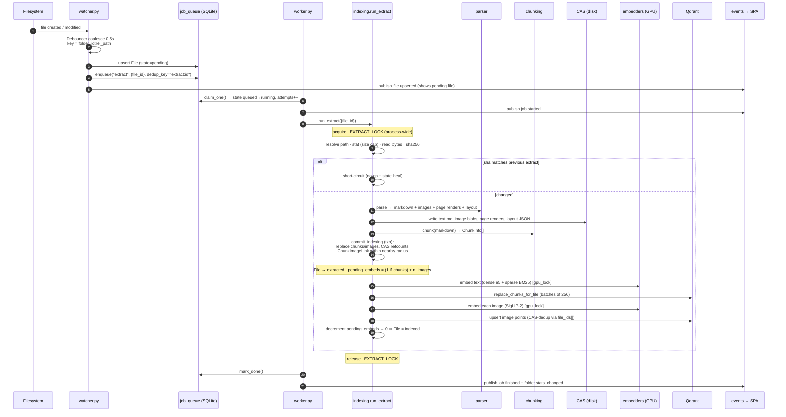

### Pipeline stages inside `services/indexing/`

Most stages are wrapped in a `_stage()` context manager for timing/logging
(the unchanged-short-circuit check is an early return, not a wrapped stage):

| # | Stage | `_stage()`? | What it does |
|---|-------|:---:|--------------|
| 0 | `check_row_state` | ✓ | Dead row ⇒ dead job: abort if the File row is gone or already `deleted` (a scan can mark a file deleted while its extract is still queued; running it would re-read — for cloud stubs re-*download* — content the app considers gone) |
| 1 | `resolve_path` | ✓ | File + Folder rows → absolute path |
| — | native Google doc export | — | `.gdoc/.gsheet/.gslides` carry no local bytes: try the **anonymous** export endpoint (works for link-shared docs → parse the rendered PDF/XLSX); else park as `unsupported` "indexed as link" (its `source_url` stays searchable) |
| 2 | `stat` | ✓ | Existence + size `< max_file_bytes` (indexing cap); oversized data files (json/csv/…) park as `unsupported` |
| — | cloud-stub guard | — | A **dataless File Provider placeholder** under `~/Library/CloudStorage` (size > 0, zero blocks) is parked as `unsupported` "cloud-only" instead of read — reading would force a synchronous, untimed full download. `VOITTA_CLOUD_MATERIALIZE_ON_INDEX=true` restores download-on-read |
| 3 | `read_bytes` | ✓ | Read full file into memory |
| 4 | `sha256` | ✓ | Hash → `file_cas_id` |
| — | short-circuit unchanged | — | Early return (no-op) if sha matches prior extract, after healing orphaned states |
| 5 | `find_parser` | ✓ | Registry lookup by extension; else → `unsupported` |
| 6 | `parse` | ✓ | `ParseResult`: markdown, figures, page renders, layout, `char_to_page` |
| 7 | `cas_write_*` | ✓ | Several stages: `cas_write_text`, `cas_write_images`, `cas_write_page_images`, `cas_write_page_layout`, `cas_write_char_to_page`, `cas_write_manifest`, … → `cas/files/<sha>/...` and `cas/images/<sha>.bin` |
| 8 | `chunk` | ✓ | Chunking registry → `ChunkInfo[]` |
| 9 | `commit_indexing` | ✓ | Txn: replace chunks/images, refcounts, `ChunkImageLink` |
| 10 | `embed_text_inline` | ✓ | Dense + sparse vectors → `chunks` collection (if any chunks) |
| 11 | `embed_image_inline` | ✓ | SigLIP-2 vectors → `images` collection, per-image (failures non-fatal) |

### PDF parsing: the MinerU daemon

PDFs parse in a **long-lived MinerU subprocess** (`_MineruDaemon` in
[parsers/pdf_parser.py](../src/voitta_rag_enterprise/services/parsers/pdf_parser.py)):
the first parse pays the ~5 s import + model load, later parses reuse the warm
process, and a watchdog hard-kills it after `pdf_parse_timeout_s` (default
600 s; the file parks as `error`, the queue moves on). PDFs over ~24 pages are
split into **buckets of `pdf_pages_per_bucket`** (default 20) and parsed
bucket-by-bucket under `gpu_lock`, then merged. On a subprocess failure the
file's stored `error` includes the **subprocess traceback tail** (the raise
site with the actual path/message — `repr()` of an `OSError` alone drops the
filename), and the full traceback lands in `logs/indexing.log`.

> **Lazy OCR models.** MinerU downloads some models on first *need*, not at
> install — e.g. the seal/stamp detection model fetches the first time a page
> contains a seal. Offline (or on a flaky link) that surfaces as
> `FileNotFoundError: …/paddleocr_torch/seal_PP-OCRv4_det_server_infer.pth` —
> the fix is to retry the file once online; the model caches permanently under
> `~/.cache/huggingface/hub`.

**Image ↔ chunk linkage:** every extracted image gets an *anchor chunk* (the
chunk straddling its position in the markdown). Chunks within
`chunk_image_link_radius` get a `nearby_image` link, with chunk-index distance
stored as the score (`chunk_image_links.distance`).

**Image dedup:** image points carry a `file_ids` **array**. If the same
`image_cas_id` was already embedded for another file, the existing point is
reused and the new `file_id` is appended instead of re-embedding.

### Parser output matrix

A `ParseResult` can carry up to four artifact kinds; what each parser emits
differs. This drives both what's searchable and what the file-tree expand view
shows (it offers an *images* row and, for PDFs only, a *layout* row).

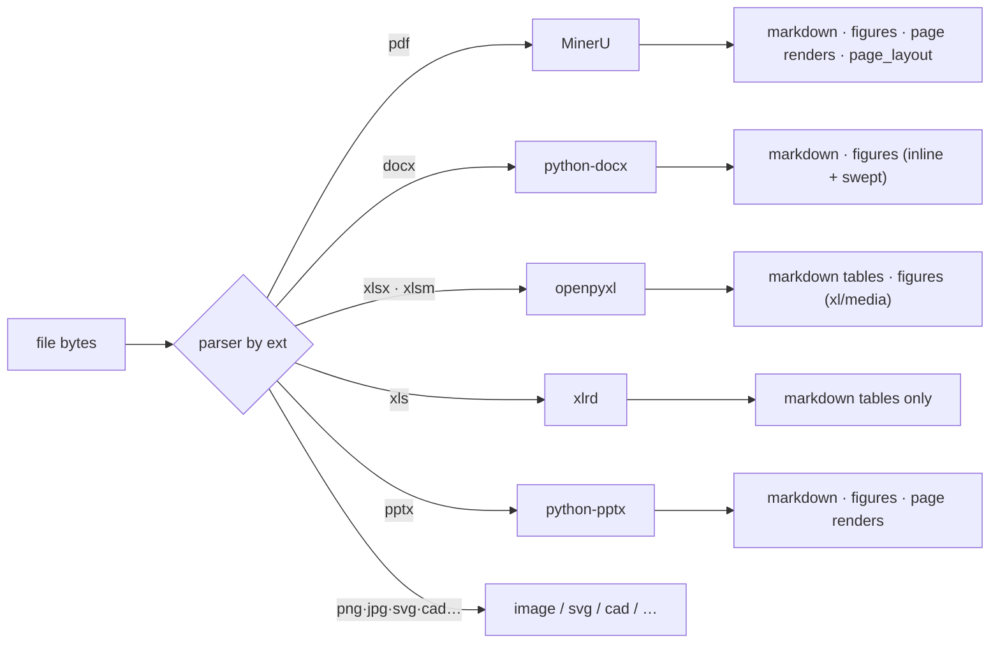

| Format | Text | Embedded images | Page renders | `page_layout.json` |
|--------|:----:|:----:|:----:|:----:|
| PDF | ✓ | ✓ (cropped figures) | ✓ (per-page WebP) | ✓ (**only PDF emits this**) |
| docx | ✓ | ✓ inline **+ swept** (anchored, tables, headers/footers) | — | — |
| xlsx / xlsm | ✓ (tables) | ✓ (harvested from `xl/media/`) | — | — |
| **xls** (legacy BIFF) | ✓ (tables) | ✗ — **text only** (OLE/Escher; not worth the cost — use .xlsx) | — | — |
| pptx | ✓ | ✓ | ✓ (slide renders) | — |
| image / svg / cad | — | ✓ (the file itself / rasterised / rendered) | — | — |

Embedded-image extraction for OOXML (docx/xlsx/pptx) harvests rasters straight
from the package `*/media/` folder ([parsers/_ooxml.py](../src/voitta_rag_enterprise/services/parsers/_ooxml.py)),
so anchored/table/header pictures aren't missed; vector parts (emf/wmf/svg) and
sub-32px glyphs are skipped. docx additionally keeps a positioned inline walk so
its figures anchor to the right chunk; swept (non-inline) and all xlsx images
land at position 0.

### File-tree expandability

The chevron is gated on *content*, decided up front from the file payload (which
carries `image_count`) — no fetch, so a picture-free office doc shows no chevron
rather than expanding to an empty "No previews". When expanded, the view loads
an *images* row and (PDF only, since `page_layout.json` is PDF-only) a *layout*
row. The fetched artifact lists are cached per file id; the cache is dropped
when a `file.upserted` event arrives with `state == "indexed"` (the file's
images/layout were just re-committed — an expanded row refetches live instead
of showing the pre-index fetch) and on `file.deleted`.

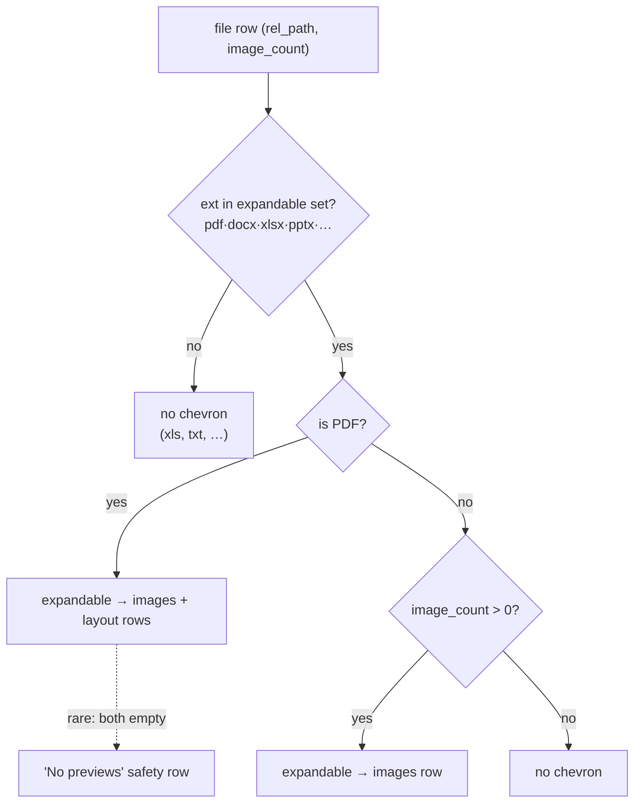

---

## 3. Job queue mechanics

A SQLite-backed queue with per-key in-flight deduplication. No automatic retry
loop — failure is terminal; the operator requeues via a folder reindex.

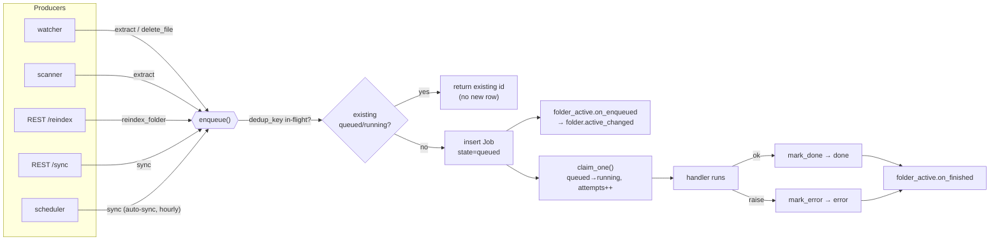

### Job kinds

| Kind | Payload | Producer | Handler |
|------|---------|----------|---------|
| `extract` | `{file_id}` | watcher, scanner, reconcile | `run_extract` |
| `embed_text` | `{file_id, round}` | inline (within extract) | `run_embed_text` |
| `embed_image` | `{image_id, round}` | inline (within extract) | `run_embed_image` |
| `delete_file` | `{file_id}` | watcher (on delete), scanner (vanished rows) | `run_delete_file` |
| `sync` | `{folder_id}` | REST `/folders/{id}/sync`, auto-sync scheduler | `run_sync` |
| `reindex_folder` | `{folder_id, file_ids}` | REST `/folders/{id}/reindex` | `run_reindex_folder` |

> **`gc_cas` is reserved, not wired.** The worker registers a `gc_cas` kind but
> it's a **no-op** and nothing enqueues it. CAS blobs *are* refcounted
> (`cas_refs`; decref stamps `last_decref_at`), and `cas/gc.py:sweep()` exists
> to reclaim long-zero blobs — but it has no callers and no scheduled job,
> so CAS is not garbage-collected at runtime.

- **Dedup key** (e.g. `extract:42`) guarantees at most one in-flight job per
  resource. A duplicate enqueue returns the existing id and does **not** bump
  the folder-active counter.
- **Attempts** increments on each `claim_one`. On process restart, any rows
  left `running` are swept to `error` ("abandoned").

---

## 4. File & job state machines

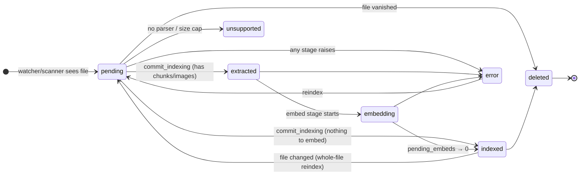

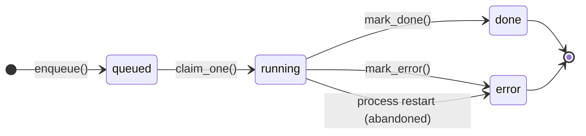

---

## 5. Event system & websocket propagation

The WebSocket is the **single source of truth** for client state. Every
server→client state update — live data *and* every modal's state — flows
through one channel: an authenticated handshake, a full **snapshot** on
connect, then coalesced **deltas**. Mutations are still HTTP `POST`/`PATCH`
(the command path); the UI never refetches — it waits for the WS echo. This is
what makes reconnect bulletproof: a dropped socket re-snapshots on reconnect,
so a client that missed events converges back to server truth with **no page
reload** and no HTTP fallback.

`services/events.py` is an in-process topic broker. Publishers (any thread)
call `events.publish(topic, event)`; per-connection `Subscription` inboxes
buffer and **coalesce** by `(type, id)` so the client sees only the latest
state per resource. `api/ws.py` authenticates, sends the snapshot, then drains
the buffer in batches — filtering every batch per-connection by ACL.

### Connection lifecycle

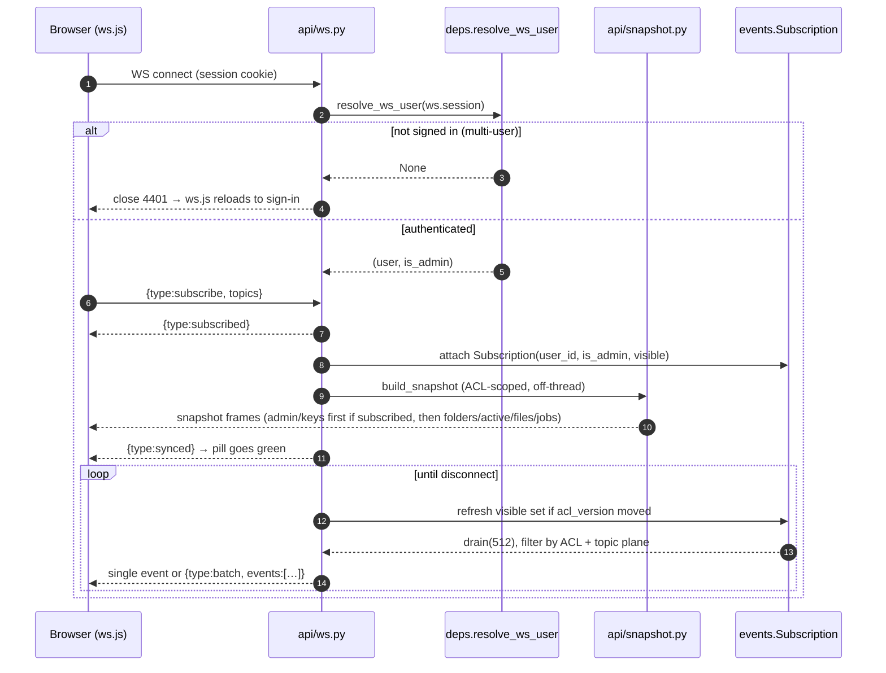

### Per-connection delivery filter (`ws.py:_deliverable`)

Three scoping planes, applied to every drained batch:

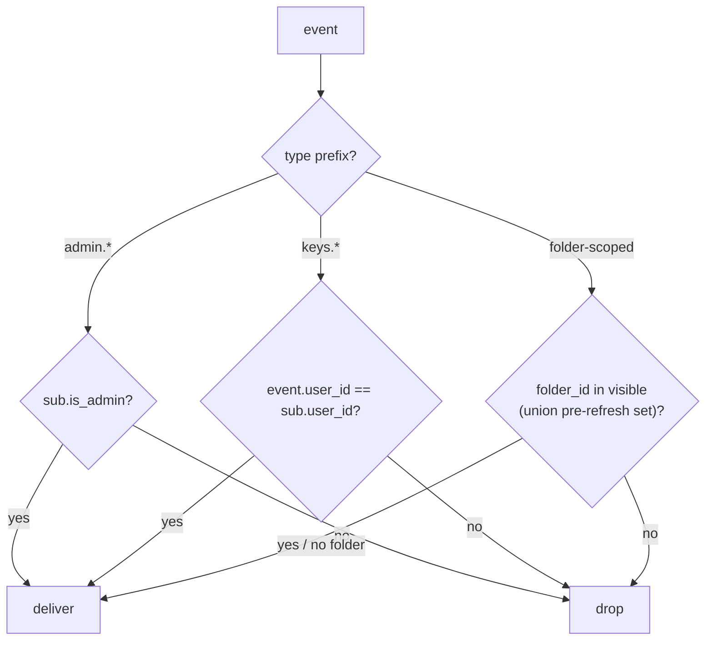

- **Folder ACL:** `_event_folder_id(event)` ∈ the connection's cached
  `visible` set (owned + granted + shared). **Admins get a real `visible` set
  just like everyone else** — `is_admin` never widens folder/file/job
  visibility, only the `admin` topic (an empty folder one user creates is
  invisible to every other user, admin or not). `visible = None` (no folder
  filter) is reserved for **single-user mode**, where the lone identity owns
  everything — there the SPA also hides the per-folder **Share** switch
  (keyed on `single_user` from `GET /api/auth/me`): with no second user the
  flag is a no-op, so the control isn't rendered at all. This mirrors
  `routes/folders.list_folders` exactly. Removals
  filter against the **union** of the pre- and post-refresh visible sets so
  `folder.removed` / `file.deleted` for a folder you *could* see still arrive
  (a folder you never could see stays filtered — no leak).
- **ACL freshness:** folder add/remove/share/grant/revoke bump a global
  `acl_version`; the pump recomputes `visible` off-thread on the next tick.
- **admin plane:** `admin.*` delivered only to admin connections.
- **keys plane:** `keys.*` delivered only to the owning user (even for admins —
  keys are personal).

### Topics & events

| Topic | Events | Scope · coalesced by |
|-------|--------|--------------|
| `files` | `file.upserted` (carries `folder_id`) | folder · `file.id` |
| `files` | `file.deleted` (enriched with `folder_id`) | folder · discrete |
| `jobs` | `job.started`, `job.finished` (enriched with `folder_id`) | folder · `job_id` |
| `jobs` | `job.progress` (transient sub-progress: `phase` + optional `done`/`total`) | folder · `job_id` |
| `folders` | `folder.upserted`, `folder.stats_changed`, `folder.sync_source_changed`, `folder.active_changed` | folder · `folder_id` |
| `folders` | `folder.added`, `folder.removed`, `folder.sync_progress`, `folder.reindex_progress`, `folder.sync_config_changed`, `folder.gd_connected`, `folder.ms_connected` | folder · discrete |
| `admin` | `admin.snapshot` (full admin-console state: allowlist, users+groups, auth-providers, caps, settings) | admin-only · discrete |
| `keys` | `keys.snapshot` (a user's **personal** API keys — company keys are HTTP-fetched on modal open, not WS-pushed) | per-user · discrete |
| `stats` | (reserved) | — |

Snapshot frames sent on connect: `{type:"snapshot", topic, items}` for
folders/active/files/jobs, plus `admin.snapshot` (admins) and `keys.snapshot`,
terminated by `{type:"synced"}`. The same `admin.snapshot` / `keys.snapshot` /
`folder.sync_config_changed` frames are re-published on the matching mutation,
so the client applies one shape whether it's the baseline or a delta.

**Backpressure:** when the buffer exceeds capacity (16384), the oldest
*coalesced* entry is evicted (the newest snapshot is always preserved). Under
heavy indexing, tens of thousands of `file.upserted` events collapse to one
final state per file id, and the pump emits one `send_text` per scheduling
tick.

> **Sync config contract:** the heavy, secret-masked per-folder connector
> config is *not* in the global snapshot. The sync modal caches it per folder
> and trusts that cache on open; `folder.sync_config_changed` (full config
> payload, `config: null` = deleted) is the **only** thing that keeps the
> cache fresh. Therefore **every route that creates or mutates a
> `folder_sync_sources` row must publish it** via
> `publish_sync_config_changed` in
> [routes/sync/base.py](../src/voitta_rag_enterprise/api/routes/sync/base.py) —
> the PUT upsert / delete / clear-error routes (`sync/core.py`) and the
> Drive-local connect (`sync/google_local.py`) all do. A route that skips the
> publish leaves the dialog rendering a stale (possibly empty) config until a
> full page reload.

### Folder stats — one snapshot, optionally subtree-scoped

`compute_folder_stats` ([services/folder_stats.py](../src/voitta_rag_enterprise/services/folder_stats.py))
is the single source for **every** number on the Details panel: file counts by
state (including `files_cloud_only` — parked cloud placeholders, a subset of
unsupported), chunks, images, bytes, and the by-extension table. One snapshot,
so the panel can never contradict itself.

- The WS push (`folder.stats_changed`) is always **folder-level**.
- `GET /api/folders/{id}/stats?dir=<rel>` returns the same shape **scoped to a
  subdirectory** (traversal-sanitized; `dir` is echoed in the payload;
  `index_health` stays folder-level — Qdrant points are tracked per folder).
- The SPA renders the panel from one cached snapshot per scope (key
  `folderId` or `"folderId:relDir"`). A stats push stores the folder-level
  payload and drops that folder's scoped keys; if a subtree is selected the
  panel refetches the scoped snapshot, throttled to ~1 per 750 ms per key.

### Tree pill: syncing → indexing → indexed

The folder tree's status pill composes two server signals
([flows/tree-model.js](../static/js/flows/tree-model.js)):

- **`indexing`** — the folder has queued/running jobs (`folder.active_changed`
  set) AND non-terminal files in the subtree.
- **`syncing`** (root rows only, overrides everything except `error`) — the
  folder's sync source has `sync_status == "syncing"`. A sync can run with
  ZERO queued jobs (e.g. Google Drive materializing its tree), which is
  exactly when "indexed" would lie. Boot truth ships as `sync_status` on
  every folder row (REST + WS snapshot); live transitions arrive as
  `folder.sync_source_changed`; the snapshot resets the overlay on reconnect.

---

## 6. Search query path

`POST /api/search` embeds the query three ways, resolves the visible-folder
ACL filter, then queries both Qdrant collections and RRF-fuses the chunk
results.

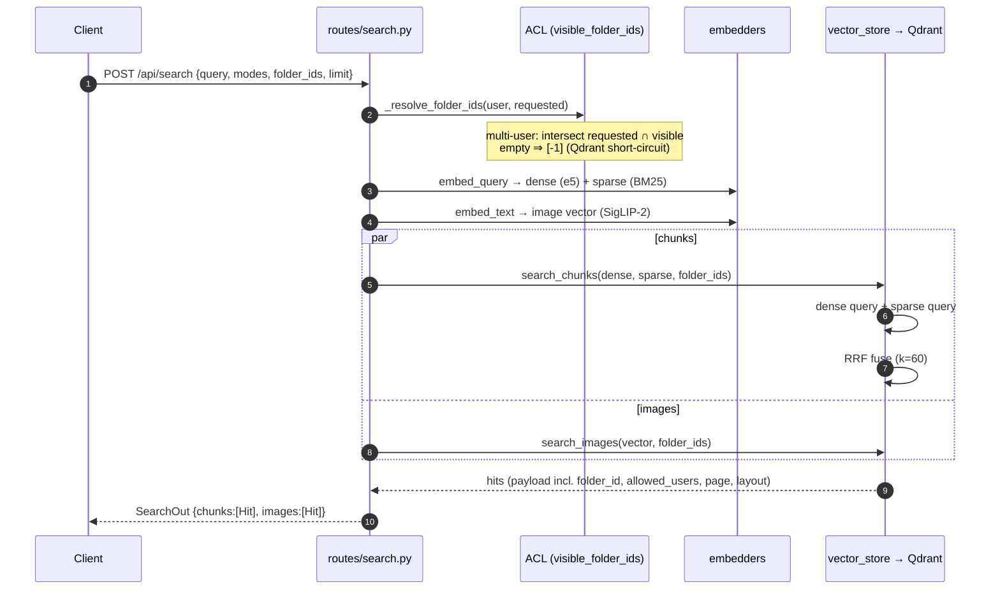

**ACL model:** access control is enforced **at the folder level, in Python**,
before the Qdrant call. The caller's identity is their **active account**
(`users.id`, see §7) — for MCP, the account the API key was minted under.
`_resolve_folder_ids` intersects the caller's requested
`folder_ids` with their *visible* set (`visible_folder_ids` — owned + ACL-granted
+ shared), so a request can't reach into another user's folder; an empty
intersection becomes `[-1]` (an impossible id) to give Qdrant a cheap no-match
path. The resulting list is passed to Qdrant as the `folder_ids` filter. In
single-user mode the filter is skipped entirely (`None`).

> Note: point payloads do carry an `allowed_users` array, but the `/api/search`
> endpoint does **not** apply a per-user `MatchValue` filter inside Qdrant — ACL
> rests on the folder-id intersection above. (`search_chunks` / `search_images`
> accept an optional `allowed_user_id`, but the REST endpoint doesn't pass it.)

### Source provenance (owner / dates) — `meta_*`

Synced objects carry provenance the local file doesn't: who owns/created it,
who last edited it, who shared the synced root, and the source created/modified
timestamps. It's captured at sync time, stored on `File.source_meta` (JSON),
and surfaced in three places: the file-preview panel, the folder Details
rollup, and as **indexed, prefilterable** `meta_*` Qdrant payload fields on
**both** collections.

**Capture (per connector, normalized by `services/source_meta.build`):**

| | Google Drive | SharePoint / OneNote |
|---|---|---|
| owner | `owners[0]` (true owner) | `createdBy.user` (creator) |
| editor | `lastModifyingUser` | `lastModifiedBy.user` |
| shared_by | root's `sharingUser` (else owner if not owned-by-me) | library `drive.owner` (**user or group**) |
| created / modified | `createdTime` / `modifiedTime` | `createdDateTime` / `lastModifiedDateTime` |

`shared_by` is **downfilled** to every descendant of the synced root (it's a
property of the root, not the item). All synced file types are covered — Drive
binaries **and** native exports (Docs/Sheets/Slides/Forms), SharePoint drive
items, Pages, and OneNote (OneNote: dates only, no clean per-page author). The
connector stamps each file's normalized meta into `.voitta_sources.json`;
`scanner.scan_folder` loads it onto `File.source_meta` (and `run_sync` triggers
that rescan so it lands without waiting for a restart).

**Flat payload fields** (`indexing/embed.py:_build_meta_payload` →
`source_meta.payload_fields`), all optional — **absent values are omitted, not
null**:

| Field | Type · index | Meaning |
|-------|------|--------|
| `meta_owner_name` / `meta_owner_email` | keyword | responsible principal |
| `meta_editor_name` / `meta_editor_email` | keyword | last modifier |
| `meta_shared_by_name` / `meta_shared_by_email` | keyword | sharer of the synced root (downfilled; may be a group) |
| `meta_created_ts` · `meta_modified_ts` · `meta_uploaded_ts` | integer (epoch s) | source created / modified / our ingest time (`File.added_at`) |

Dates are epoch **seconds** so Qdrant `Range(gte=…/lte=…)` filters work; people
fields are `keyword` for exact match. Indexes are declared in
`vector_store._META_PAYLOAD_INDEXES` (derived from the `source_meta` field
tuples) and created on collection init. `meta_modified_ts` falls back to
filesystem mtime **only for non-synced files** (`source_url is None` — local
uploads / NFS / GitHub), where it's the real modified time; synced files always
use the source date (never the download time). The `meta_*` payload is
populated at **index time**, so existing folders need a **reindex** to backfill
the Qdrant fields.

**Where it shows in the UI** — the sidebar's **Meta** tab (one of Details /
Meta / Jobs) is the single home for all "who/when", rendered selection-aware by
`sidebar.renderMeta` from the per-file `provenance` on the `files` store (so it
populates after a sync — no reindex needed):
- **file selected** → that file's Owner · Modified by (only when ≠ owner) ·
  Shared by · Created · Modified · Indexed.
- **folder/subtree selected** → a rollup of the **selected subtree's** files
  (client-side, scoped like the Details count cards): shared-by, distinct
  owners with file counts, and the created/modified range.

(The Details tab is purely counts/stats; the file preview is purely
name + download + body. Provenance lives only on the Meta tab.)

---

## 7. Identity & accounts: sign-in gate, Clerk directory, switching

### The account model

A `users` row is an **account**, not a person: the unique key is
`(email, company_id)`. `company_id = ''` is the reserved **Personal** account;
a real company account's id is the **Clerk organization id** (`org_…`), with
`company_name` as a display-only label refreshed at every login (an org rename
in Clerk can't fork accounts — identity is the id). Everything downstream —
`folders.owner_id`, `folder_acl`, `folder_user_settings`, `api_keys`,
`user_groups` — hangs off `users.id`, so **all of it is account-scoped for
free**: Ivan-as-Agnitio and Ivan-as-Demo are strangers unless a folder is
explicitly granted or community-shared. (Company `cvk_` API keys are the one
deliberate exception: they hang off a company scope, not an account — see
*API keys* below.)

**Sharing is community-scoped, never global** (`folders.shared = 1`): a
company account shares into its Clerk company; a natively-allowed Personal
account shares into the `"native"` community (allowlist users/domains +
super-admins); accounts with no community can't share and see no community
shares (`services/acl/community.py:account_community`). An unowned shared folder
(owner deleted) falls back to native visibility. Explicit `folder_acl`
grants are unaffected and are fanned out to all accounts of the grantee's
email at grant time.

Two person-level exceptions, both keyed by email across all account rows:

- **Admin** (`is_admin`) — checked with "any row of this email has the flag"
  and stamped onto every row on change
  (`services/acl/accounts.py:person_is_admin` / `stamp_person_admin`). A
  per-account admin flag would be confusing and provide no real isolation.
- **Sharing** — `POST /folders/{id}/grant` (and revoke) expands the target
  account id to **all accounts of that email** (snapshot semantics: accounts
  created by later logins don't inherit past grants).

### Sign-in gate (Google OAuth callback)

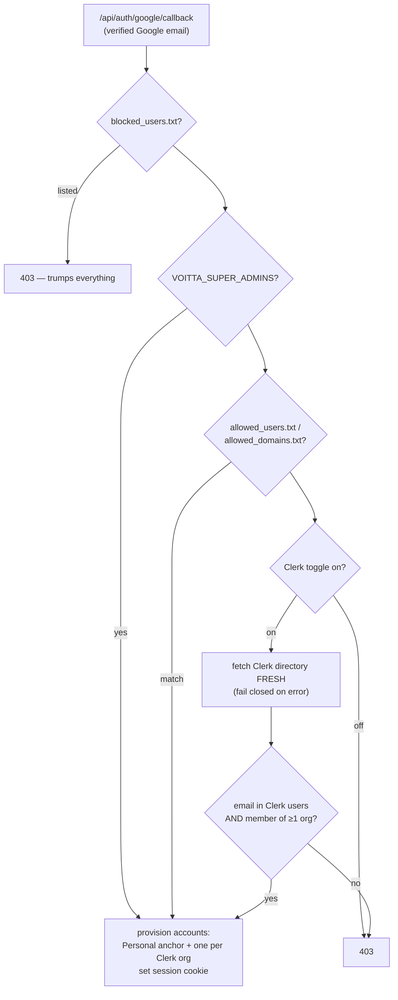

**Org membership is the Clerk credential**: a Clerk user who belongs to no
organization is not admitted via the Clerk path (they may still pass the
native rules). Every account-holder gets a Personal row as a stable anchor,
but it is **offered** (dropdown, account switch, default landing) only to
natively-allowed emails — Clerk-only users operate exclusively in their
company accounts, and their Personal anchor is unreachable even by direct
API call (`services/acl/accounts.py:offered_accounts_for_email`).

Admission via Clerk pulls the directory **live during the callback** — never
from a cache. If Clerk is unreachable, only the native rules apply
(Clerk-only users are denied until Clerk is back; native users are
unaffected). **No Clerk data is persisted beyond the identity columns**
(`company_id`, `company_name`, display name) — there is no directory cache on
disk; the admin UI's Clerk tabs are a live proxy too.

Super-admins get `is_admin` re-stamped (person-level) on every sign-in, so
the env var stays the recoverable source of truth.

### Session & per-request resolution

The session is a signed cookie (Starlette `SessionMiddleware`) holding
`user_email`, `active_account_id`, and (for admins) `acting_as_user_id` —
ids only, nothing Clerk-derived. On every request/WS connect,
`api/deps.py:_resolve_account` maps the email + `active_account_id` to the
active `users` row, **validating the row belongs to that email** (a stale or
forged id falls back to Personal rather than crossing identities).
`VOITTA_SINGLE_USER` / `VOITTA_DEV_USER` resolve to the Personal account.

- `GET /api/auth/me` → active account (`company_id`/`company_name`) + the
  full `accounts` list + provenance flags (`is_super_admin`,
  `native_allowed`).
- `POST /api/auth/account/{id}` → switch the active account (own accounts
  only; 404 otherwise). The SPA's company dropdown (next to the user pill,
  hidden for single-account users) calls this and hard-reloads so every
  store re-keys.
- **MCP**: `BearerAuthMiddleware` resolves the bearer token to
  `(email, account_id)`, dispatching on the token prefix — personal `vk_`
  keys via `identity_for_token`, company `cvk_` keys via
  `resolve_company_identity` (see below).

### API keys: personal (`vk_`) and company (`cvk_`)

Two key kinds share the hashing scheme (SHA-256 at rest, plaintext shown
once at creation, short prefix for display) but differ in what a token
means ([routes/api_keys.py](../src/voitta_rag_enterprise/api/routes/api_keys.py) /
[routes/company_keys.py](../src/voitta_rag_enterprise/api/routes/company_keys.py)):

| | Personal `vk_…` | Company `cvk_…` |
|---|---|---|
| Identity | the key **is** the identity — one key per account, minted while that account was active | key + **user email** pair; the key selects the company scope, the email selects the person |
| Who mints | any user (Settings modal) | admins only, always for the **active account's scope**: native admins / super-admins for whichever of their accounts is active; Clerk **org admins** for their own org |
| Scope | the account the key was minted under | one company: a Clerk org (`org_…`) or the native space (`company_id=''`) |
| Email check | none at request time | **every request**: native space → sign-in allowlist rules; Clerk org → live membership (5-min TTL cache); block-list always trumps |
| Provisioning | account must exist | (email, company) account row is **JIT-provisioned** — members never have to sign in first |
| Revocation | cuts off one client | cuts off **every** client in the company using that token |

Company-key wire contract (either form; the header wins when both present):

```
Authorization: Bearer cvk_…
X-Voitta-User-Email: alice@example.com
        — or —
Authorization: Bearer cvk_…:alice@example.com
```

Clerk fail-safe semantics: if Clerk is unreachable (or the toggle is off),
an org-scoped key keeps working for emails that already have an
(email, org) account row — a past login or a past successful membership
check — and rejects unknown emails. The org-admin **management** gate is
stricter: it fails **closed** (403) when Clerk can't answer, since minting
is rarer and higher-stakes than reading. Membership lookups go through
`services/clerk.py:fetch_org_members` — a per-org `{email: role}` map
cached for 5 minutes, keyed by (secret-key hash, org id) so key rotation
can't serve stale members.

Either way the resolved identity is the same `(email, account_id)` tuple,
so folder ACLs, search scoping, and MCP tools downstream are key-kind
agnostic.

**REST access.** The same keys authenticate the REST surface — every
`/api/*` route the SPA uses (folders, upload, files, sync config/triggers,
search, jobs, users, images) accepts `Authorization: Bearer vk_…/cvk_…`
with identical semantics to MCP (`api/deps.py:_bearer_user`, branched at
the top of `real_user` so the UI and API can never diverge). Exclusions:
identity-requiring routes under `/api/admin/*` and `/api/auth/*` are
session-cookie only (403 with a valid key) — except `GET /api/auth/me`,
which works as a bearer "whoami". The dep-less auth routes (config,
login/callback, logout) never consult keys: the guard lives inside the
bearer branch, so it only fires where an identity is resolved.
Precedence rules: a `vk_`/`cvk_` bearer wins over the dev/single-user env
shortcuts (explicit credential beats env fallback — deliberately unlike
MCP's middleware, which bypasses bearer in those modes); a non-Voitta
`Authorization` header (e.g. proxy-injected) falls through to the cookie
chain; bearer identity is never remapped by a cookie session's lingering
impersonation or account-switch state. Interactive docs: `/api/docs`
(Swagger UI) + `/api/openapi.json`, gated by the same auth — the root
FastAPI `/docs`, `/redoc`, `/openapi.json` are disabled because they'd
serve the schema unauthenticated. Quickstart with curl examples:
[API.md](API.md).

### Provenance badges

Rendered from `/me` (top bar) and per row in Admin → Users
(`static/js/components/badges.js`):

| Badge | Meaning |
|-------|---------|
| `SUPERADMIN` | email in `VOITTA_SUPER_ADMINS` (always shown) |
| `VOITTA NATIVE` | active account is Personal and the email passes the native allowlist |
| *company name* (purple) | active account is a company account (from Clerk) |
| `CLERK` | Personal account of a Clerk-directory user with no native allowlist entry |

### Directory tabs (admin modal)

Two independent display-only toggles on the Sign-in gate tab (persisted in
`settings.json`): **Native directory** shows/hides the editable Users +
Groups tabs; **Clerk directory** (toggle + `sk_…` secret key, pre-filled
from `CLERK_SECRET_KEY` / `VOITTA_CLERK_SECRET_KEY` in `.env` when the
stored value is empty) shows/hides read-only **Clerk users** / **Clerk
companies** tabs. Those render from `GET /api/admin/clerk/directory` — a
live, uncached proxy to the Clerk Backend API
([services/clerk.py](../src/voitta_rag_enterprise/services/clerk.py);
note: Clerk sits behind Cloudflare, which 403s generic user-agents — the
client sends an explicit UA). The Clerk toggle is also what arms the
Clerk admission path in the sign-in gate above.

Admin → Users groups the per-account rows by email — one line per person,
one company chip per account; delete removes all of the person's accounts.

---

## 8. Admin settings: storage & propagation

Two things to keep separate here:

- **Backend storage & read path** — file/DB, lazy, no cache. The consumers
  (`is_email_allowed`, `get_caps`, `get_nfs_root`, the `admin_user` dep) re-read
  their backing store on each use.
- **Client propagation** — **WS-pushed**, not pull-based. After a mutation,
  the `api/routes/admin/` package calls `publish_admin_state()`
  (`admin/base.py`), which rebuilds the full admin state and emits an
  `admin.snapshot` on the **admin-only** `admin` topic.
  The admin modal renders from the `adminState` store — no GET on open, no
  refetch after mutation — so a change in one admin's tab shows up live in
  another's.

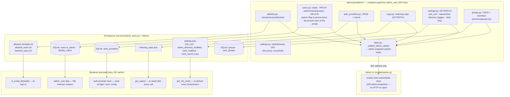

### What lives where

| Setting | Persistence | Read path | Invalidation |
|---------|-------------|-----------|--------------|
| Allowed domains / users / blocklist | plain `.txt` files (`<data>/admin/`) | `is_email_allowed()` at sign-in (Clerk path layered on top — see §7) | takes effect at next sign-in |
| `is_admin` flag · `display_name` | SQLite `users` (flag stamped on **all** account rows of the email) | `admin_user` dep (person-level check), per request | next request; super-admins re-stamped each login |
| Directory toggles + Clerk secret key | `settings.json` (`native_directory_enabled`, `clerk_enabled`, `clerk_secret_key` — empty key falls back to `.env`) | sign-in gate (Clerk admission) + admin UI tab visibility | next sign-in / next `admin.snapshot` |
| User groups (organizational only) | SQLite `groups` + `user_groups` | `services/groups.py`; in `admin.snapshot` | live WS push on every group/membership change |
| Auth providers (OAuth catalog) | SQLite `auth_providers` | read at login / sync-config time | next login or restart (env rows re-seed) |
| NFS root | `settings.json` | `get_nfs_root()` | re-probed on every browse/sync call |
| Indexing caps | `indexing_caps.json` | `get_caps()` — **always re-reads disk** | every call (no cache) |
| API keys (per-user, *not* admin) | SQLite `api_keys` | per-user, on demand | re-fetched on demand |
| Company API keys (admin-minted, company-scoped) | SQLite `company_api_keys` | verified on **every** MCP request: token hash + user-email scope check (Clerk membership TTL-cached 5 min) | key delete is immediate; Clerk membership changes within the cache TTL |

### Propagation properties

- **Backend reads: no caching.** Every read hits the file/DB fresh. A comment
  in `indexing_caps.py` notes that *cross-process* invalidation would require a
  pubsub channel — fine for the single-process default deployment.
- **Client: WS-pushed.** The admin modal renders from the `adminState` store,
  fed by `admin.snapshot` (on connect to admins, and re-pushed after every
  mutation). No pull-on-open, no post-mutation refetch. A focus-guard skips the
  re-render while the admin is editing an input so a concurrent push can't
  clobber in-progress typing.
- **API keys, likewise.** `modals/settings.js` renders personal keys from the
  `keysState` store (per-user `keys.snapshot`), pushed after each
  create/delete. The **company-keys** section in the same modal is the one
  exception to "no pull": it HTTP-fetches `GET /auth/company-keys` on open —
  the server's 403 for non-admins is what hides the section, so no role
  logic ships to the client.
- **Atomic writes.** Text/JSON files are written to `.tmp` then `os.replace()`d.
- **Admin vs per-user settings are distinct UIs and WS planes.**
  `modals/admin.js` (admin-only `admin` topic) edits deployment-wide settings;
  `modals/settings.js` (per-user `keys` topic) edits that user's personal API
  keys — plus, for scope admins, the active company's `cvk_` keys (§7).

### Sequence: an admin changes an indexing cap

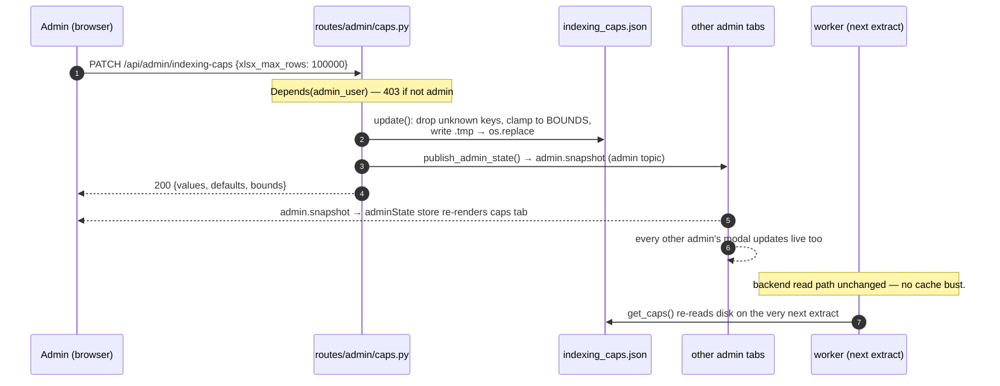

---

## 9. OAuth providers: admin defines → user consumes

There are **two separate provider mechanisms** — don't conflate them:

| | **Login auth providers** | **Sync connectors** |
|---|---|---|
| Table | `auth_providers` (global catalog) | `folder_sync_sources` (per-folder) |
| Managed by | admin, via Admin → OAuth tab | folder owner, via Sync modal |
| Purpose | sign-in identity (currently Google) | pulling content from Drive/SP/Teams/GitHub/NFS |
| Scopes | `openid email profile` | per-connector (e.g. `drive.readonly …`) |
| Tokens | session cookie | per-folder refresh token |

The design: the admin defines an OAuth app **once** in the `auth_providers`
catalog, and **every user** picks it as a shortcut in the per-folder sync modal
— the picker pre-fills `client_id` / `client_secret` so the user doesn't have to
register their own Google/Azure app.

> **Gate.** `GET /api/admin/auth-providers` is gated by `current_user` — the
> list is readable by any authenticated user, so the shared-shortcut picker
> works for non-admins. Only the mutating routes (POST/PATCH/DELETE/check) are
> `admin_user`-gated. The response includes `client_secret` by design — it's the
> shared app credential users are meant to use, and it lands in their folder's
> sync row regardless.

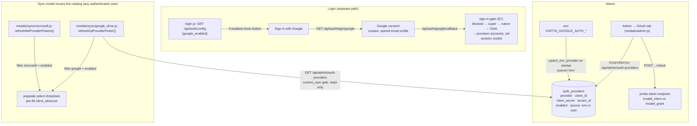

### How a regular user *discovers* providers

- **Login button:** `login.js` calls `GET /api/auth/config`, which returns
  `{google_enabled}` derived from whether the `.env` Google client id/secret
  are set. (Login currently reads `.env` directly, not the `auth_providers`
  table — only `google_enabled` is exposed, so Microsoft/GitHub rows are
  stored but not wired to login.)
- **Sync picker:** the sync modal (`modals/sync/google_drive.js` /
  `microsoft.js`) calls `GET /api/admin/auth-providers` (readable by
  any signed-in user) and filters for `enabled` rows of the relevant provider.
  The matching rows populate the picker for **every** user; selecting one
  pre-fills the credentials into the per-folder form. Manual entry remains
  available if no catalog provider fits.

### Admin-defined OAuth provider lifecycle

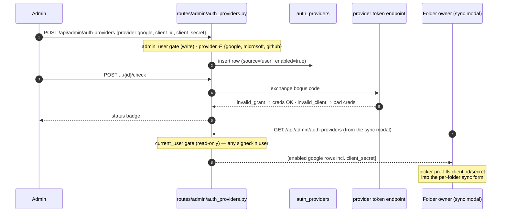

---

## 10. Sync OAuth runtime flows

Once a folder's sync source has client credentials (typed or pre-filled from
the catalog), the per-folder OAuth dance runs in a popup. The `folder_id` is
carried through OAuth `state` (base64). On callback the **refresh token is
stored on the folder's sync-source row**, and a websocket event tells the
modal it can close.

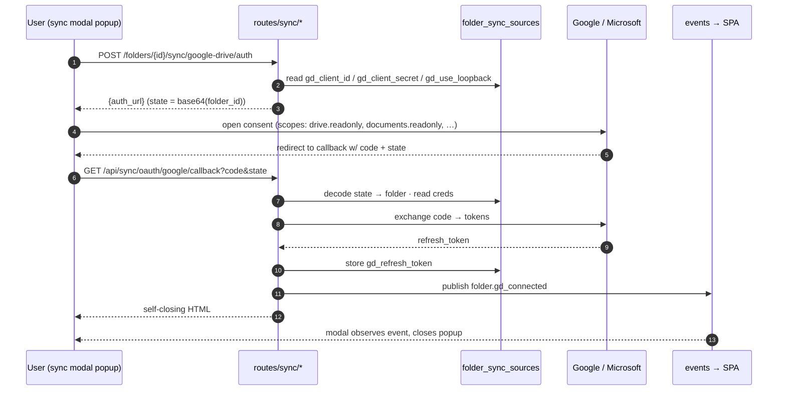

**Redirect URIs** (two modes per provider):

- Standard: `{proto}://{host}/api/sync/oauth/{google|microsoft}/callback`
  (proto/host from `X-Forwarded-*` headers).
- Loopback: fixed `http://localhost:53682/api/sync/oauth/{…}/callback`
  (toggle `*_use_loopback`; the modal shows which URI is active).

**Microsoft specifics:** the same flow targets
`login.microsoftonline.com/{tenant_id}/oauth2/v2.0/{authorize,token}` with
delegated scopes (`offline_access Sites.Read.All Files.Read.All …`) and handles
the admin-consent redirect. Microsoft **rotates** refresh tokens on most
refreshes — connectors persist the new token whenever
`auth.rotated_refresh_token` is set. SharePoint and Teams share the same `ms_*`
credential fields.

### Connector matrix

| Provider | `source_type` | Auth methods | Token storage | `supports_progress` |
|----------|---------------|--------------|---------------|:---:|
| Google Drive (API) | `google_drive` | OAuth · service-account JSON | `gd_refresh_token` (per folder) | ✓ |
| Google Drive (local) | `google_drive_local` | none — rides the installed *Drive for Desktop* app | — | ✓ |
| GitHub | `github` | SSH key · PAT · none | `gh_token` / `gh_pat` (per folder) | ✗ |
| SharePoint | `sharepoint` | OAuth · app-secret · app-cert | `ms_refresh_token` (OAuth) | ✓ |
| Teams | `teams` | OAuth · app-secret · app-cert | `ms_refresh_token` (OAuth) | ✓ |
| Confluence | `confluence` | Cloud (email + API token, Basic) · Server/DC (PAT) | `cf_token` (per folder) | ✓ |
| Jira | `jira` | Cloud (email + API token, Basic) · Server/DC (PAT) | `jira_token` (per folder) | ✓ |
| NFS | `nfs` | none (path under admin `nfs_root`) | — | ✓ |

(That's the full set of **8 source types**; a unit test —
`tests/unit/test_sync_registry.py` — pins the registry to exactly this
list. Confluence/Jira scope by selected spaces/projects or a CQL/JQL query,
with an optional `*_updated_since` incremental cutoff.)

### Google Drive local (`google_drive_local`) — index-in-place, no credentials

macOS desktop only ([services/sync/cloud_local.py](../src/voitta_rag_enterprise/services/sync/cloud_local.py)).
Instead of downloading via the API, the folder's `path` *is* the account mount
under `~/Library/CloudStorage/GoogleDrive-…`, and the user picks subtree(s)
(`gdl_paths`) in the sync modal's "This Mac" tab (tri-state tree; reopening
the dialog pre-checks the saved selection from the config payload's `paths`).

- **Never writes into the Drive.** Sync is a **stat-only walk** of the
  selected subtrees — no reads, no downloads. The provenance sidecar lives
  under `data_dir/cloud_sidecars/<folder_id>.json`, never inside the mount.
- **Outage-safe.** Sync and scan both refuse to run when the Drive app is
  offline or the mount is empty — a transient outage never purges the index.
- **No filesystem watcher** (FSEvents is unreliable on File Provider mounts);
  refresh is driven by manual "Sync now" and the auto-sync scheduler, each
  followed by a rescan.
- **Dataless placeholders** (size > 0, zero local blocks) are parked by the
  extract worker as `unsupported` "cloud-only" — counted as
  `files_cloud_only` in folder stats and shown as a Cloud-only row in the
  Details panel. Making the files "Available offline" in Drive and reindexing
  indexes them; `VOITTA_CLOUD_MATERIALIZE_ON_INDEX=true` opts into
  download-on-read instead.
- **Native Google docs** (`.gdoc/.gsheet/.gslides`) are JSON pointers with no
  local content: the sidecar records their web URL (searchable as links), and
  the extract path tries the anonymous export for link-shared docs (see the
  pipeline-stage table in §2).

### Connector contract & registry

Each connector subclasses `SyncConnector`
([services/sync/base.py](../src/voitta_rag_enterprise/services/sync/base.py)) and
declares its own `source_type` + `supports_progress` as class attributes. They
self-register in
[services/sync/registry.py](../src/voitta_rag_enterprise/services/sync/registry.py)
(same pattern as `parsers/registry`); the core resolves them via
`get_connector(source_type)` — there is **no `source_type` if-else** in the
dispatch path.

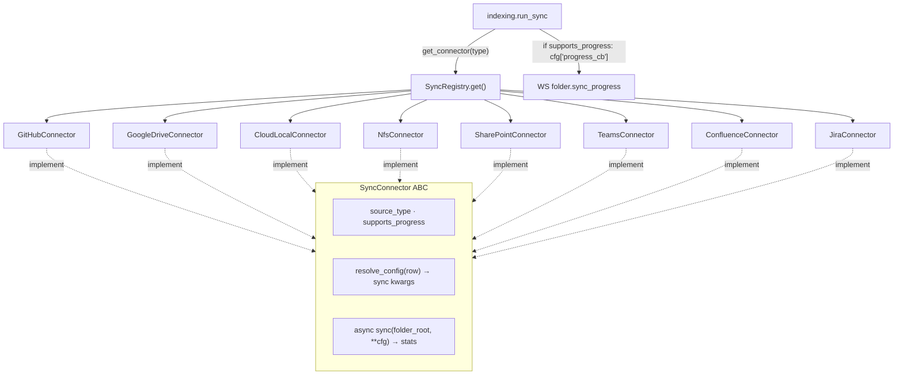

`run_sync` builds the per-connector kwargs by calling `connector.resolve_config(row)`
(each connector reads its own `gh_*`/`gd_*`/`ms_*`/`nfs_*` columns), then adds a
`progress_cb` only when `connector.supports_progress`. Adding a sync backend is a
new connector module + one registry line — no edit to `run_sync`.

---

## 11. Data model

SQLite holds **metadata only**. Content lives in CAS; vectors live in Qdrant.

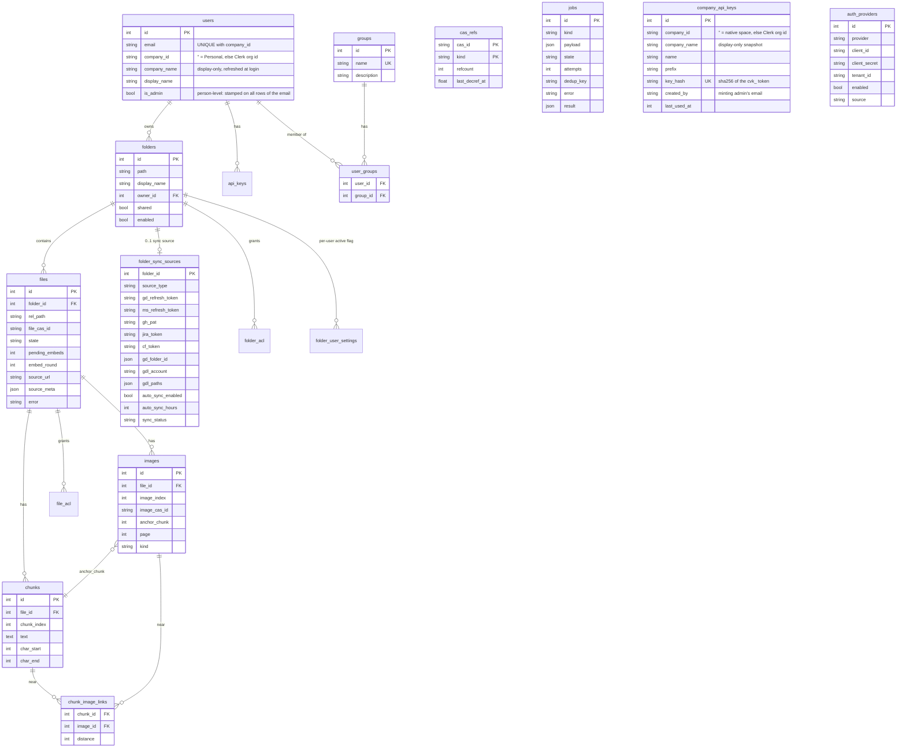

`company_api_keys` deliberately has **no FK to `users`** — a company key
belongs to a *scope* (`company_id`), not an account. The paired user email
is resolved (and its account row JIT-provisioned) at request time, so
deleting or adding members never touches key rows (§7).

### CAS layout on disk

```
cas/
├── files/<file_sha>/
│   ├── text.md                 parsed markdown
│   ├── page_layout.json        per-page block layout (if parser emits)
│   ├── layout_summaries.json   per-page indexed summary scalars
│   ├── char_to_page.json       char offset → page number
│   ├── on_demand_assets.json   LLM-callable asset menu
│   └── manifest.json           parser name, chunk/image counts
└── images/<image_sha>.bin      raw image bytes
```

`cas_refs(cas_id, kind, refcount, last_decref_at)` tracks delete-readiness:
decref stamps `last_decref_at` when refcount hits zero. `cas/gc.py:sweep()`
would reclaim blobs that have been zero for a quiet period — but it's **not
wired to a job or scheduler** (see the `gc_cas` note in §3), so blobs
accumulate rather than being swept at runtime.

---

## 12. Locking model

Three coordination primitives keep the C-level libraries, the GPU, and
QdrantLocal's thread-pinned SQLite connection safe.

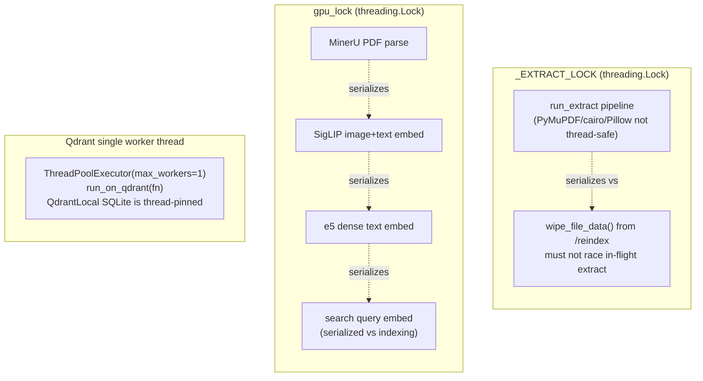

| Lock | Protects | Why |
|------|----------|-----|
| `_EXTRACT_LOCK` | the whole extract pipeline + `wipe_file_data` | PyMuPDF/cairo/Pillow C decoders corrupt the heap under parallelism; also prevents a `/reindex` wipe (REST thread) from racing an in-flight extract (worker thread) |
| `gpu_lock` | every model inference (MinerU, SigLIP, e5) | serializes GPU work, including search-query embeds vs. indexing, so they don't collide on the device |
| Qdrant worker thread | all Qdrant I/O | QdrantLocal's SQLite connection is pinned to its creating thread; routing every call through one worker keeps it thread-safe |

The default worker pool size is **1**, so two workers can't collide in the
pipeline even without `_EXTRACT_LOCK` — but the lock remains necessary for the
REST-thread/worker-thread reindex race.

---

## 13. Logging & observability

> **TL;DR — where the logs are:** `<data_dir>/logs/` — server default
> `~/.voitta-rag-enterprise/logs/`, **desktop app**
> `~/Library/Application Support/Voitta RAG/data/logs/`. The per-job detail
> stream is `indexing.log` — extract stages, sync connectors, MinerU
> subprocess tracebacks, all ctx-tagged. Watch live with
> `tail -f "<data_dir>/logs/indexing.log"`.

### Live progress surfaces (so long steps don't look frozen)

- **Startup readiness** — model warmup, Qdrant orphan sweeps, and index-health
  run in a **background task after the server starts serving** (so the UI is
  reachable immediately). `GET /api/health` returns `{phase, ready}`; the SPA
  shows a top "Starting up — <phase>…" banner until `ready`, where phase walks
  `reconciling jobs → sweeping orphan vectors → checking index health →
  loading models → ready`. The warmup→worker-start order is preserved inside
  the task (concurrent CUDA contexts corrupt the heap).
- **Per-job sub-progress** — `_stage()` emits a transient `job.progress`
  (`phase` + optional `done`/`total`) for the job bound on the worker context;
  the embed long-pole ticks per 256-chunk batch. The Jobs panel shows it inline
  ("Extract foo.pdf — embedding text 800/1521"). Ephemeral (not persisted); a
  reconnect shows "running" until the next tick.
- **Not surfaced:** `gc_cas` is unwired (no scheduler enqueues it; the handler
  is a no-op), so there's nothing to show — CAS isn't garbage-collected at
  runtime (see §3).

Application logging is **file-only by design** — `logging_config.setup_logging`
([logging_config.py](../src/voitta_rag_enterprise/logging_config.py)) installs
`RotatingFileHandler`s and then `_strip_console_handlers()` removes every
stdout/stderr handler *except* uvicorn's. So a `screen`/`systemd` console shows
only uvicorn's banner + HTTP access lines — **the absence of app logs on the
console is intentional, not a sign logging is off.** Look in the files.

```mermaid
flowchart TB
    subgraph src["Loggers"]
        APP["voitta_rag_enterprise.*<br/>(worker · indexing · sync · …)"]
        ROOT["root + third-party<br/>(uvicorn.error, qdrant, …)"]
        TP["noisy third-party<br/>mineru · transformers · PIL · urllib3 …"]
        LG["loguru (mineru internals)"]
        UV["uvicorn / uvicorn.access"]
    end

    APP -->|DEBUG| IDX[("logs/indexing.log<br/>per-job DEBUG, ctx-tagged")]
    ROOT -->|INFO| APPLOG[("logs/app.log<br/>INFO catch-all")]
    TP -->|pinned WARNING| APPLOG
    LG -->|WARNING| MIN[("logs/mineru.log")]
    UV -->|kept on console| CON["console / screen session"]

    IDX & APPLOG & MIN -.->|RotatingFileHandler<br/>10 MB × 5 backups| ROT["…log.1 … .log.5"]
```

### Files (under `<data_dir>/logs/`)

`<data_dir>` defaults to `~/.voitta-rag-enterprise` and is overridable with
`VOITTA_DATA_DIR` (`main.py` calls `setup_logging(settings.data_dir / "logs")`).

| File | Level | Contents |
|------|-------|----------|
| `indexing.log` | **DEBUG** | Everything from the `voitta_rag_enterprise` package — worker claim/done, the per-stage extract pipeline, **sync connectors**, embeds, **MinerU subprocess tracebacks**. The first place to look. |
| `app.log` | INFO (`VOITTA_LOG_LEVEL`) | Root catch-all + third-party (uvicorn.error, qdrant_client, …). Noisy libs (mineru, transformers, PIL, urllib3, …) pinned to WARNING. |
| `mineru.log` | WARNING | MinerU/loguru internals (its own sink, redirected off stderr). |

Each rotates at **10 MB**, keeping **5 backups** (`.log.1` … `.log.5`).

### Desktop app log map

The macOS app has **three** log surfaces under
`~/Library/Application Support/Voitta RAG/`:

| File | Written by | Contents |
|------|-----------|----------|
| `voitta-rag.log` | shell (`voitta_rag_desktop`) | menu-bar shell + installer + uvicorn banner/access lines + anything on raw stdout/stderr. Append-mode with per-session `===== … session start =====` banners; rolls to `.log.1` at 5 MB. **App-internal diagnostics are NOT here** — they're in `data/logs/` (below). |
| `data/logs/*.log` | the enterprise app (`setup_logging`) | the standard server log set above — `indexing.log` is where extract/sync/MinerU failures land. |
| `data/qdrant_managed/qdrant.log` | managed Qdrant sidecar | the child's stdout/stderr, truncated each boot; its tail is included in startup-failure errors and the watchdog's CRITICAL line. |

### Per-job context tagging

`bind_context(**fields)` attaches a `ctx` field to every record in scope, so
worker/indexing/sync lines carry `[job_id=… kind=… folder_id=… file_id=…]`.
That makes one resource's full lifecycle a single grep:

```bash
LOGS=~/.voitta-rag-enterprise/logs

# Everything that happened for one job (e.g. a sync):
grep "job_id=20821" "$LOGS"/indexing.log*

# One file's full extract → chunk → embed trace, across worker threads:
grep "file_id=6655" "$LOGS"/indexing.log*

# All sync activity (begin / per-branch / done summary):
grep "services.sync" "$LOGS"/indexing.log*

# Live tail while you trigger a sync/reindex from the UI:
tail -f "$LOGS"/indexing.log
```

A successful GitHub sync, for instance, reads end-to-end as:

```
worker  [job_id=20821 kind=sync] worker-0 claim job
indexing [folder_id=31] sync begin folder=… type=github
sync.github [folder_id=31] git sync: …agnitio-platform-fe.git branches=['rory-roman']
sync.github [folder_id=31] branch synced: rory-roman in 2.2s
indexing [folder_id=31] sync done … {'branches_synced': 1, 'commits_written': 0, 'errors': []}
worker  [job_id=20821 kind=sync] worker-0 job done
```

`commits_written: 0` with no following `extract` jobs = the remote was
unchanged, so nothing was re-indexed (a fast, correct "done" — not a skip).

---

*Generated from a source trace of `src/voitta_rag_enterprise/` and `static/js/`.
Line-level references were accurate at the time of writing; treat file paths as
the durable anchors and re-verify specifics against the code.*
