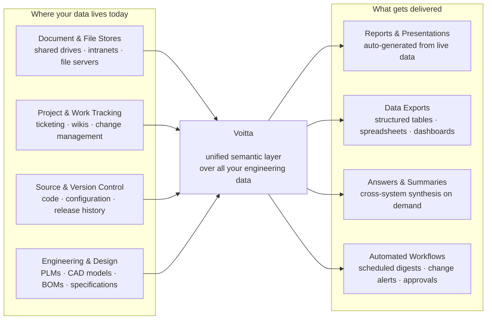
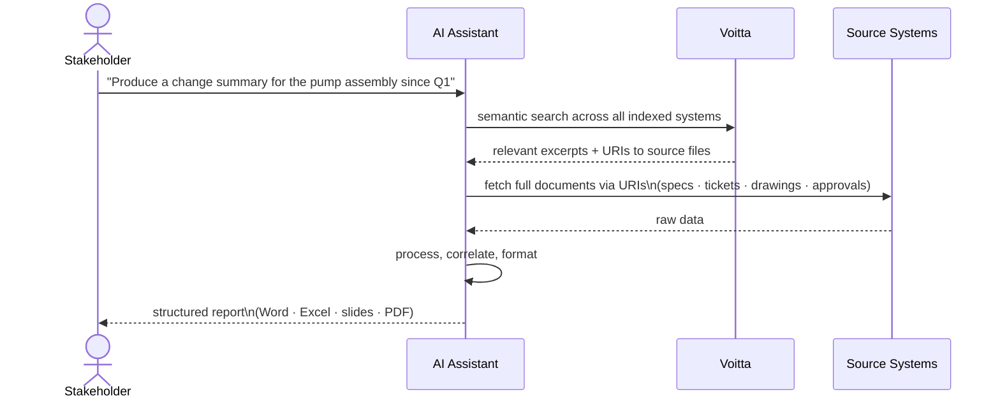

# Voitta — Unified Semantic Layer for Engineering Data

Voitta continuously indexes your organisation's data across every system of record,
making it accessible to the tools and workflows that turn raw information into decisions.

---

## The Big Picture

---

## How It Works in Practice

The key pattern that sets Voitta apart from simple search:

> Voitta does not just answer questions — it gives an AI assistant **direct access to the underlying data**,
> so the output can be a fully worked deliverable, not a summary.

---

## What Teams Get

| Deliverable | How Voitta enables it |
|---|---|
| **Change reports** | Correlate design revisions, tickets, and approvals across systems automatically |
| **Specification exports** | Pull the latest approved specs from PLM, CAD, and docs into one structured file |
| **Status dashboards** | Aggregate live data from project tracking, engineering, and document stores |
| **Compliance packages** | Collect and format evidence from multiple systems on demand |
| **Onboarding materials** | Synthesise relevant context from all sources for a given project or product area |
| **Cross-system search** | One question, one answer — regardless of where the information lives |

---

## Why This Is Different

Traditional approaches require someone to know *which system* holds the answer, then log in, search, export, and manually stitch results together.

Voitta removes that friction: the knowledge layer sits above all systems, speaks the same language as modern AI tools, and returns not just text but **links to the actual source files** — so downstream processing works on real, complete data rather than excerpts.
